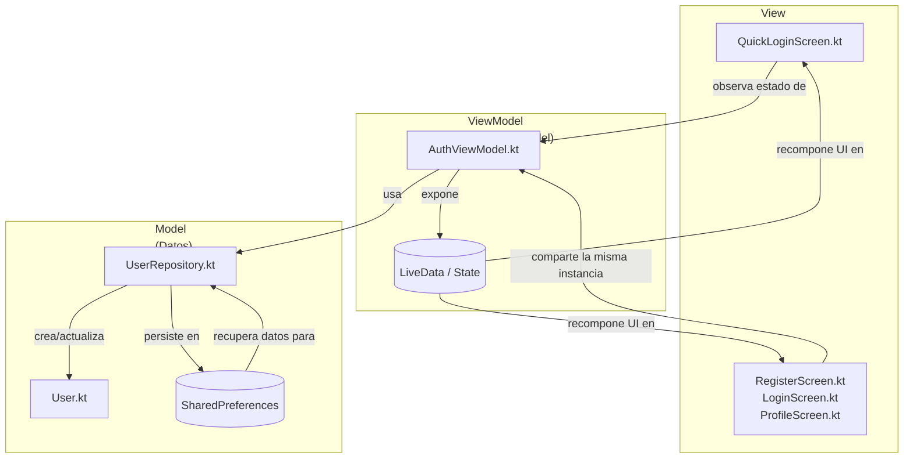
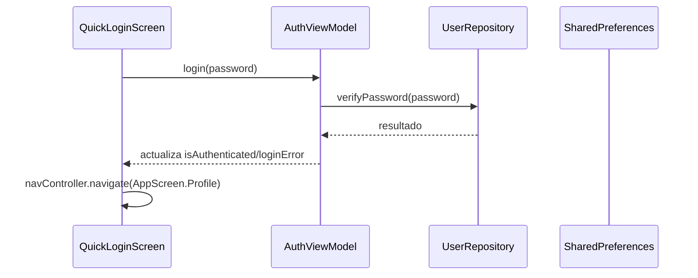

# duoc-App

Aplicacion Android construida con Jetpack Compose que ilustra un flujo de autenticacion rapido y pantallas protegidas mediante el patron MVVM. Esta guia esta pensada para programadores novatos que desean comprender, paso a paso, como se arma la interfaz, los formularios y la navegacion usando este repositorio como ejemplo real.

---

## 1. Arquitectura general paso a paso

Antes de escribir una sola linea de UI conviene entender como se reparten las responsabilidades:

1. **Vista (Compose)**: archivos en `app/src/main/java/com/example/app/view/` muestran pantallas y capturan eventos del usuario.
2. **ViewModel (lógica de presentación)**: `AuthViewModel` en `viewmodel/` guarda el estado de sesion y expone funciones como `login` o `registerUser`.
3. **Capa de datos**: `UserRepository` en `data/` lee y escribe usuarios en `SharedPreferences`.
4. **Modelo**: `User` en `model/` define la forma del objeto que viaja entre capas.

El siguiente diagrama Mermaid resume el flujo de datos y muestra las tres capas del patron **MVVM** (View, ViewModel, Model) dentro de esta app:



La secuencia de autenticacion basica funciona asi:



---

## 2. Jetpack paso a paso en este proyecto

Jetpack es un conjunto de bibliotecas oficiales de Android. En esta app usamos tres bloques claves:

### 2.1 Compose (capa de interfaz)
- Las pantallas son funciones `@Composable` que describen la UI en Kotlin.
- Cada composable recibe estado y callbacks; no mantiene referencias a vistas tradicionales.
- Ejemplo: `QuickLoginScreen` observa el nombre del usuario y decide que texto mostrar.

### 2.2 Lifecycle y ViewModel
- `AuthViewModel` extiende `AndroidViewModel` para conservar datos cuando rota la pantalla.
- Expone `LiveData` (`currentUser`, `isAuthenticated`, `loginError`) que la vista transforma en estado Compose con `observeAsState`.

### 2.3 Navigation Compose
- `AppNavigation.kt` usa `NavHost` y `NavController` para definir rutas (`AppScreen`).
- Las pantallas navegan al invocar `navController.navigate(AppScreen.AlgunaRuta.route)`.

---

## 3. Seccion clave: Composables y como crear un layout

Si es tu primera vez con Compose, sigue estos pasos inspirados en `QuickLoginScreen` (`app/src/main/java/com/example/app/view/QuickLoginScreen.kt`):

### 3.1 Paso a paso
1. **Declara el composable**
   ```kotlin
   @OptIn(ExperimentalMaterial3Api::class)
   @Composable
   fun QuickLoginScreen(navController: NavController, authViewModel: AuthViewModel?) {
       val sharedAuthViewModel = authViewModel ?: viewModel()
       val currentUser by sharedAuthViewModel.currentUser.observeAsState()
        val isAuthenticated by sharedAuthViewModel.isAuthenticated.observeAsState(false)

        LaunchedEffect(Unit) { sharedAuthViewModel.refreshCurrentUser() }
        LaunchedEffect(isAuthenticated) { /* navegacion */ }
        // ...
   }
   ```
   - `@Composable` indica que es parte de la UI.
   - `viewModel()` obtiene (o crea) una instancia compartida de `AuthViewModel`.
   - `observeAsState` convierte `LiveData` en un valor Compose reactivo.
   - `LaunchedEffect` ejecuta bloques cuando cambia una clave (ej. al iniciar la pantalla o al autenticarse).

2. **Configura el `Scaffold`** para montar elementos de Material Design como `TopAppBar`.
   ```kotlin
   Scaffold(
       topBar = { TopAppBar(title = { Text("Iniciar Sesion") }) }
   ) { innerPadding ->
       // Contenido principal
   }
   ```

3. **Diseña el contenido con `Column`** y aplica modificadores para espaciado.
   ```kotlin
   Column(
       modifier = Modifier
           .padding(innerPadding)
           .fillMaxSize()
           .padding(24.dp),
       horizontalAlignment = Alignment.CenterHorizontally,
       verticalArrangement = Arrangement.Center
   ) {
       Text(text = "Hola de nuevo", fontSize = 28.sp, fontWeight = FontWeight.Bold)
       currentUser?.let { Text("Bienvenido, ${'$'}{it.name}") }
   }
   ```

4. **Agrega campos y botones**: Compose recalcula automaticamente cuando cambien las variables `remember` o el `LiveData` del ViewModel.
   ```kotlin
   OutlinedTextField(
       value = password,
       onValueChange = {
           password = it
           sharedAuthViewModel.clearError()
       },
       label = { Text("Contrasena") },
       visualTransformation = if (passwordVisible) VisualTransformation.None else PasswordVisualTransformation()
   )

   Button(
       onClick = { sharedAuthViewModel.login(password) },
       enabled = password.isNotBlank(),
       modifier = Modifier.fillMaxWidth().height(56.dp)
   ) {
       Text("Iniciar Sesion")
   }
   ```

### 3.2 Puntos clave para novatos
- `Modifier` es como una lista de instrucciones: `fillMaxSize()` ocupa el espacio disponible, `padding(24.dp)` añade margen.
- `Arrangement.Center` centra verticalmente el contenido dentro de la `Column`.
- `remember { mutableStateOf("") }` crea estado local (por ejemplo, para un campo de texto) que solo interesa a la vista.

---

## 4. Seccion clave: Como crear un formulario interactivo

Veamos el formulario de registro (`RegisterScreen.kt`) y desglosemos cada paso.

### 4.1 Estado local y validaciones
```kotlin
var name by remember { mutableStateOf("") }
var password by remember { mutableStateOf("") }
var confirmPassword by remember { mutableStateOf("") }
var passwordVisible by remember { mutableStateOf(false) }
var confirmPasswordVisible by remember { mutableStateOf(false) }
```
- Cada variable mantiene el valor actual de un campo.
- `by remember { mutableStateOf(...) }` simplifica el acceso evitando `value = value`.

### 4.2 Campos de texto con feedback inmediato
```kotlin
OutlinedTextField(
    value = name,
    onValueChange = {
        name = it
        sharedAuthViewModel.clearError()
    },
    label = { Text("Nombre") },
    singleLine = true
)
```
- `onValueChange` actualiza el estado local y limpia errores previos en el ViewModel.
- Para contraseñas se usa `PasswordVisualTransformation()` y un boton en `trailingIcon` que alterna visibilidad.

### 4.3 Mostrar errores de validacion
```kotlin
loginError?.let { error ->
    Text(
        text = error,
        color = MaterialTheme.colorScheme.error,
        modifier = Modifier.padding(bottom = 16.dp)
    )
}

if (password != confirmPassword && confirmPassword.isNotEmpty()) {
    Text(
        text = "Las contrasenas no coinciden",
        color = MaterialTheme.colorScheme.error,
        modifier = Modifier.padding(bottom = 16.dp)
    )
}
```
- Compose solo dibuja el texto de error cuando existe un mensaje, evitando condicionales complejos.

### 4.4 Accion del boton y navegacion
```kotlin
Button(
    onClick = {
        if (password == confirmPassword) {
            sharedAuthViewModel.registerUser(name, password)
        }
    },
    enabled = name.isNotBlank() && password.isNotBlank() && password == confirmPassword
)
```
- La logica de negocio queda en el ViewModel. Si el registro tiene exito, el `LiveData` `registrationSuccess` cambia y la pantalla navega a `ProfileScreen`.

### 4.5 Resumen para principiantes
1. Declara variables con `remember` para retener el texto ingresado.
2. Muestra errores en tiempo real segun el estado del ViewModel.
3. Bloquea el boton hasta que las validaciones se cumplan.
4. Invoca funciones del ViewModel; evita manipular datos directamente en la vista.
5. Usa `registrationSuccess` para controlar la navegacion y mostrar mensajes al usuario.

---

## 5. Seccion clave: Como navegar de una pantalla a otra

Compose Navigation permite definir destinos y moverse entre ellos sin gestionar fragments manualmente.

### 5.1 Define las rutas
`AppScreen` centraliza las rutas como objetos:
```kotlin
sealed class AppScreen(val route: String) {
    object Welcome : AppScreen("welcome")
    object Login : AppScreen("login")
    object QuickLogin : AppScreen("quick_login")
    object Profile : AppScreen("profile")
    // ...
}
```

### 5.2 Configura el grafo de navegacion (`AppNavigation.kt`)
```kotlin
NavHost(navController = navController, startDestination = startDestination) {
    composable(AppScreen.Welcome.route) {
        WelcomeScreen(navController, authViewModel)
    }
    composable(AppScreen.Login.route) {
        LoginScreen(navController, authViewModel)
    }
    composable(AppScreen.QuickLogin.route) {
        QuickLoginScreen(navController, authViewModel)
    }
    composable(AppScreen.Profile.route) {
        ProfileScreen(navController, authViewModel)
    }
}
```
- `startDestination` se calcula segun haya un usuario guardado (`QuickLogin`) o no (`Login`).
- El mismo `AuthViewModel` se pasa a cada pantalla para evitar duplicar estado.

### 5.3 Dispara navegaciones desde las pantallas

1. **Inicio de sesion rapido** (`QuickLoginScreen`):
   ```kotlin
   LaunchedEffect(isAuthenticated) {
       if (isAuthenticated == true) {
           navController.navigate(AppScreen.Profile.route) {
               popUpTo(AppScreen.QuickLogin.route) { inclusive = true }
           }
       }
   }
   ```
   - `LaunchedEffect` se ejecuta cuando `isAuthenticated` cambia.
   - `popUpTo` elimina la pantalla de login de la pila para que el usuario no pueda volver atras con el boton back.

2. **Cambio a otra cuenta**:
   ```kotlin
   TextButton(onClick = {
       navController.navigate(AppScreen.Login.route)
       sharedAuthViewModel.clearError()
   }) {
       Text(currentUser?.let { "No soy ${'$'}{it.name}" } ?: "Iniciar con otra cuenta")
   }
   ```

3. **Cierre de sesion** (`ProfileScreen`):
   ```kotlin
   LaunchedEffect(isAuthenticated) {
       if (isAuthenticated == false) {
           navController.navigate(AppScreen.Welcome.route) {
               popUpTo(AppScreen.Profile.route) { inclusive = true }
           }
       }
   }
   ```

### 5.4 Consejos para novatos
- Siempre reutiliza `AppScreen` para navegar; evita escribir rutas a mano.
- Limpia la pila (`popUpTo`) cuando una pantalla ya no debe regresar (ej. despues de loguearse).
- Usa `rememberNavController()` solo una vez en la funcion raíz (`AppNavigation`); en otras pantallas recibe `NavController` por parametro.

### 5.5 Guia rapida de pruebas
1. Ejecuta la app: deberias ver `WelcomeScreen` o `QuickLoginScreen` segun haya usuario guardado.
2. Registra una cuenta nueva con `RegisterScreen` y verifica que `ProfileScreen` muestre el nombre y fecha.
3. Cierra sesion: deberias volver a `WelcomeScreen` y el enlace de "Iniciar con otra cuenta" debe seguir disponible.
4. Reinicia la app: `AuthViewModel` reconstruye el estado leyendo a traves de `UserRepository`.

---

## 6. Principios de arquitectura movil aplicados

1. **Separacion de capas**:
   - Vista (`view/`): Compose.
   - ViewModel (`viewmodel/`): maneja reglas de autenticacion y expone estado observable.
   - Datos (`data/`): acceso a SharedPreferences encapsulado en `UserRepository`.
2. **Flujo unidireccional de datos**: entradas suben desde la vista al ViewModel; salidas bajan como `LiveData`/`State`.
3. **Persistencia y resiliencia**: al usar `AndroidViewModel`, el repositorio se crea con el contexto de aplicacion y sobrevive a recreaciones de actividad.

---

## 7. Patron MVVM aplicado en detalle
- **Model**: `User` (`model/User.kt`) transporta nombre, contrasena y fecha de creacion.
- **ViewModel**: `AuthViewModel` (`viewmodel/AuthViewModel.kt`) ofrece
  - `login`, `loginWithCredentials`, `registerUser`
  - `logout`, `deleteUser`, `refreshCurrentUser`
  - `LiveData` para estado actual, mensajes de error y exito de registro.
- **View**: pantallas Compose como `LoginScreen`, `RegisterScreen`, `ProfileScreen` consumen ese estado a traves de `observeAsState` y reaccionan sincronicamente.

Ventajas:
- La UI no conoce detalles de persistencia.
- Podemos probar `AuthViewModel` con fakes de `UserRepository`.
- Cambiar la fuente de datos (ej. base de datos) solo afecta a la capa `data/`.

---

## 8. Buenas practicas extraidas del proyecto
- Mantener la UI libre de operaciones de bloqueo o de almacenamiento.
- Reusar el mismo ViewModel entre pantallas que comparten estado (se logra pasandolo en `AppNavigation`).
- Limitar `remember` a estados de interfaz (ej. mostrar contraseña) y delegar el resto al ViewModel.
- Centralizar rutas de navegacion en `AppScreen` para prevenir errores tipograficos.
- Mostrar mensajes de error usando `loginError` en lugar de `Toast`, facilitando pruebas.

---

## 9. Comandos utiles para practicar
- `./gradlew assembleDebug` compila la APK Debug.
- `./gradlew lint` revisa estilo, Compose y recursos.
- `./gradlew testDebugUnitTest` ejecuta pruebas unitarias locales.

---

## 10. Referencias para profundizar
- [Jetpack Compose](https://developer.android.com/jetpack/compose)
- [Navigation Compose](https://developer.android.com/jetpack/compose/navigation)
- [Guia oficial de arquitectura Android](https://developer.android.com/topic/architecture)

```kotlin
@OptIn(ExperimentalMaterial3Api::class)
@Composable
fun QuickLoginScreen(navController: NavController, authViewModel: AuthViewModel?) {
    val sharedAuthViewModel = authViewModel ?: viewModel()
    val currentUser by sharedAuthViewModel.currentUser.observeAsState()

    LaunchedEffect(Unit) { sharedAuthViewModel.refreshCurrentUser() }

    Scaffold(
        topBar = { TopAppBar(title = { Text("Iniciar Sesion") }) }
    ) { innerPadding ->
        Column(
            modifier = Modifier
                .padding(innerPadding)
                .fillMaxSize()
                .padding(24.dp),
            horizontalAlignment = Alignment.CenterHorizontally,
            verticalArrangement = Arrangement.Center
        ) {
            Text(text = "Hola de nuevo", fontSize = 28.sp, fontWeight = FontWeight.Bold)
            currentUser?.let { Text("Bienvenido, ${'$'}{it.name}") }
            // ...
        }
    }
}
```

Pasos clave para construir layouts:
1. Usar `Scaffold` para estructurar `topBar`, `content` y acciones.
2. Delegar el espaciado con `Modifier.padding` y `Arrangement` en `Column`.
3. Componer UI segun el estado: `currentUser?.let { ... }` solo renderiza cuando se dispone de datos.

## Formularios en Compose
El formulario de registro (`RegisterScreen.kt`) combina `OutlinedTextField`, manejo de estado local y validaciones ligeras. Extraemos el fragmento central:

```kotlin
var name by remember { mutableStateOf("") }
var password by remember { mutableStateOf("") }
var confirmPassword by remember { mutableStateOf("") }

OutlinedTextField(
    value = name,
    onValueChange = {
        name = it
        sharedAuthViewModel.clearError()
    },
    label = { Text("Nombre") },
    singleLine = true
)

OutlinedTextField(
    value = password,
    onValueChange = {
        password = it
        sharedAuthViewModel.clearError()
    },
    label = { Text("Contrasena") },
    visualTransformation = if (passwordVisible) VisualTransformation.None else PasswordVisualTransformation()
)

Button(
    onClick = {
        if (password == confirmPassword) {
            sharedAuthViewModel.registerUser(name, password)
        }
    },
    enabled = name.isNotBlank() && password == confirmPassword
)
```

Buenas practicas aplicadas:
- El estado de UI (`name`, `password`) vive en la composicion porque solo preocupa a ese formulario.
- `sharedAuthViewModel.clearError()` sincroniza la vista con la capa de negocio al modificar el input.
- El boton valida condiciones antes de delegar en el ViewModel.

### Por que estas practicas importan
- Guardar `name`, `password` y `confirmPassword` con `remember { mutableStateOf("") }` (`app/src/main/java/com/example/app/view/RegisterScreen.kt:70`) mantiene esos valores locales a la pantalla. El `AuthViewModel` queda libre de detalles efimeros y se puede reutilizar en otras vistas sin arrastrar campos temporales.
- Cada `OutlinedTextField` limpia errores al capturar texto nuevo (`app/src/main/java/com/example/app/view/RegisterScreen.kt:71`). La llamada `sharedAuthViewModel.clearError()` borra `loginError` en el ViewModel (`app/src/main/java/com/example/app/viewmodel/AuthViewModel.kt:83`), asi la interfaz refleja inmediatamente la correccion del usuario.
- El boton de registro solo se habilita cuando las contrasenas coinciden y no hay campos vacios (`app/src/main/java/com/example/app/view/RegisterScreen.kt:145`). Dentro del `onClick` vuelve a verificar la condicion antes de invocar `sharedAuthViewModel.registerUser(...)`, evitando enviar datos invalidos y simplificando validaciones en el ViewModel. El mismo patron se repite en el login rapido (`app/src/main/java/com/example/app/view/QuickLoginScreen.kt:31`).

## Navegar entre pantallas con Navigation Compose
`AppNavigation.kt` define el grafo de destinos usando `NavHost` y la clase sellada `AppScreen`:

```kotlin
NavHost(navController = navController, startDestination = startDestination) {
    composable(AppScreen.Welcome.route) {
        WelcomeScreen(navController, authViewModel)
    }
    composable(AppScreen.Login.route) {
        LoginScreen(navController, authViewModel)
    }
    composable(AppScreen.QuickLogin.route) {
        QuickLoginScreen(navController, authViewModel)
    }
    composable(AppScreen.Profile.route) {
        ProfileScreen(navController, authViewModel)
    }
}
```

Cada pantalla decide cuando navegar. Ejemplos concretos:

- **Transicion por exito de login:** en `QuickLoginScreen`, `LaunchedEffect(isAuthenticated)` llama `navController.navigate(AppScreen.Profile.route)` y usa `popUpTo(AppScreen.QuickLogin.route)` para evitar volver atras.
- **Cambio de cuenta:** el enlace "Iniciar con otra cuenta" navega a `AppScreen.Login.route` y limpia errores previos.
- **Cierre de sesion:** `ProfileScreen` observa `isAuthenticated`; si pasa a `false`, manda al usuario a `AppScreen.Welcome.route`.

## Principios de arquitectura movil aplicados

- **Separacion de capas:**
  - Vista (`view/`): renderiza Compose y emite eventos.
  - ViewModel (`viewmodel/AuthViewModel.kt`): coordina logica de autenticacion y expone `LiveData`.
  - Datos (`data/UserRepository.kt`): encapsula SharedPreferences y mantiene el modelo `User` (`model/User.kt`).
- **Flujo unidireccional:** eventos suben desde la vista hacia el ViewModel y resultados bajan como estado observado.
- **Persistencia y resiliencia:** `AuthViewModel` (subclase de `AndroidViewModel`) reconstruye el repositorio tras cambios de configuracion.

## Patron MVVM aplicado
- **Model:** `User` captura nombre, contrasena y fecha de creacion.
- **ViewModel:** `AuthViewModel` ofrece operaciones de login, registro, logout y refresco, actualizando `LiveData` consumidos por Compose.
- **View:** pantallas Compose observan esos `LiveData` mediante `observeAsState` y se recomponen automaticamente.

Esta configuracion evita que la UI almacene logica de negocio y facilita las pruebas unitarias sobre el ViewModel o el repositorio.

## Buenas practicas extraidas del proyecto
- Delegar en el ViewModel cualquier interaccion con datos.
- Compartir instancias de ViewModel entre destinos para evitar estados divergentes.
- Usar `remember` para estado estrictamente visual (ej. mostrar/ocultar contrasena) y `LaunchedEffect` para efectos colaterales controlados.
- Centralizar rutas en `AppScreen` para prevenir errores de escritura y permitir refactors simples.

## Comandos utiles
- `./gradlew assembleDebug` compila la APK debug.
- `./gradlew lint` verifica reglas de Compose y recursos.
- `./gradlew testDebugUnitTest` ejecuta pruebas locales.

## Referencias
- [Jetpack Compose](https://developer.android.com/jetpack/compose)
- [Navigation Compose](https://developer.android.com/jetpack/compose/navigation)
- [Guia oficial de arquitectura](https://developer.android.com/topic/architecture)
